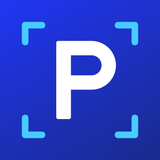
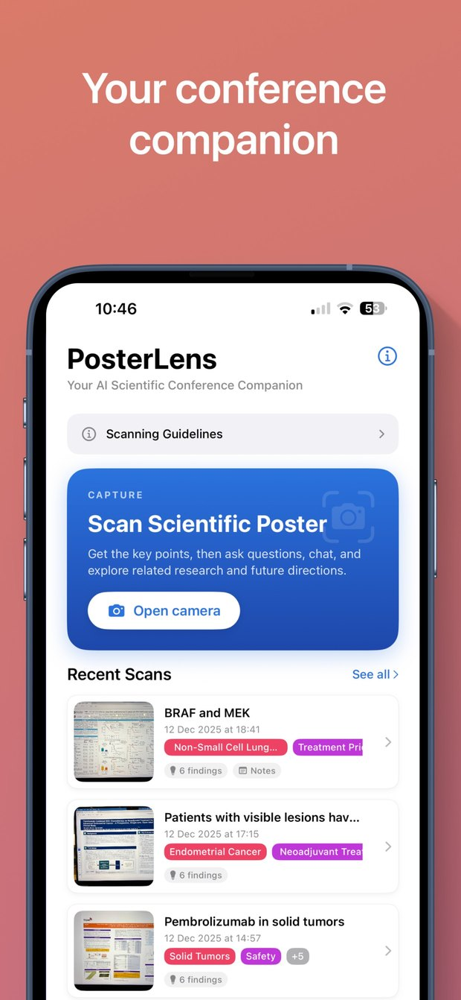
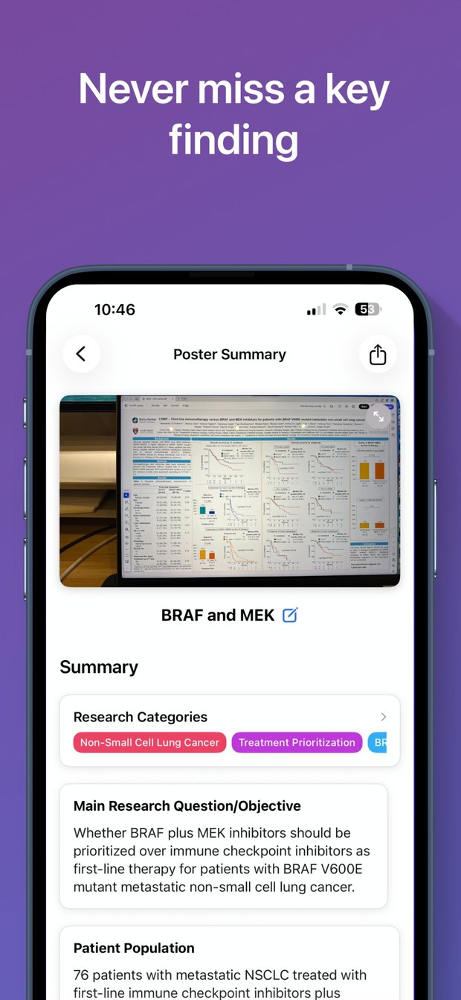
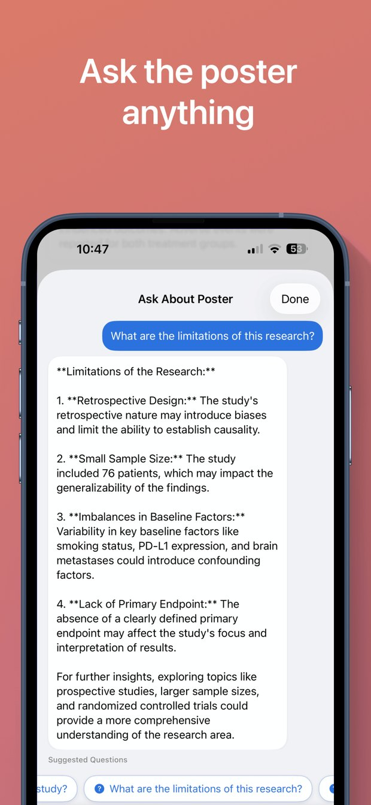
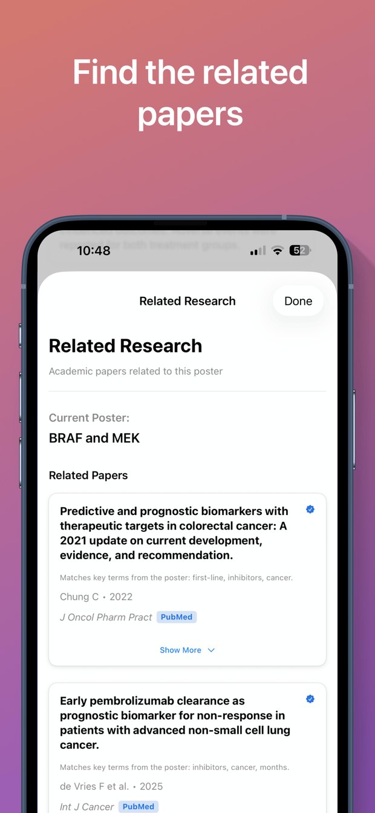
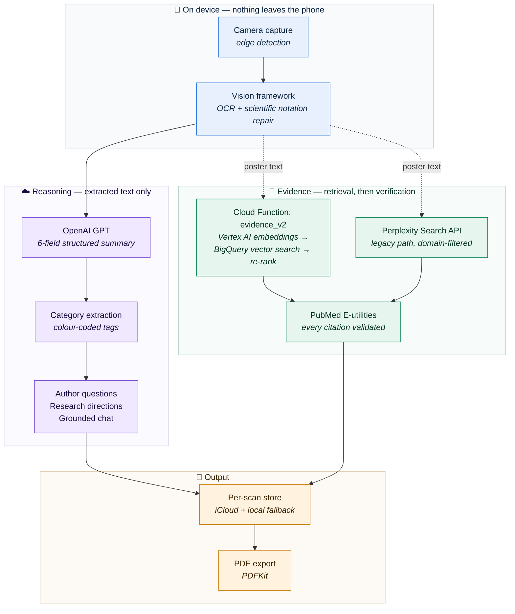

<div align="center">



# PosterLens

**Point your phone at a scientific poster. Walk away understanding it.**

PosterLens turns a conference poster into a structured summary, a set of questions worth
asking the presenter, and a shortlist of the real papers behind the work — in about a minute,
from a single photo.

[](https://apps.apple.com/app/id6745453368)
[](https://docs.perplexity.ai/docs/cookbook/showcase/posterlens)
[](https://github.com/nickjlamb/PosterLens/releases)
[](https://www.apple.com/ios/)
[](https://swift.org)
[](https://github.com/nickjlamb/PosterLens/actions/workflows/ci.yml)
[](LICENSE)

[Quick start](#quick-start-60-seconds) ·
[How it works](#how-it-works) ·
[Examples](docs/EXAMPLES.md) ·
[Architecture](docs/ARCHITECTURE.md) ·
[Roadmap](ROADMAP.md) ·
[Changelog](CHANGELOG.md)

</div>

---

<div align="center">






<sub><a href="docs/EXAMPLES.md">See the full walkthrough →</a></sub>

</div>

---

## The problem

A big oncology congress puts up two thousand posters over four days. You get perhaps ninety
seconds in front of each one, standing up, in a crowd, often without the presenter there.
The information density is brutal: a phase III readout compressed into a QR code and eight
point type.

Photographing the poster does not solve this. You end up with 200 photos you never open again.

PosterLens is the step that photo was supposed to be.

## What it does

| | |
|---|---|
| **Reads the poster** | Edge-detected capture, then on-device OCR via Apple's Vision framework. Nothing leaves the phone at this stage. |
| **Structures it** | A six-field summary: research question, patient population, primary endpoint (verbatim only when the poster actually states one), methodology, key results, conclusions. |
| **Tags it** | Automatic research-category detection, colour coded, so a week of scanning stays navigable. |
| **Arms you** | Suggested questions for the presenter, written to be worth asking — bias, confounding, endpoint choice — not "can you tell me more?". |
| **Finds the evidence** | Semantic retrieval over a PubMed corpus, with every citation validated against PubMed E-utilities before it is shown. Vancouver formatted, real links. |
| **Answers follow-ups** | Chat grounded in the poster text you captured, for the questions the summary did not anticipate. |
| **Keeps it** | Per-scan storage in your iCloud container with a local fallback, searchable history, PDF export. |

## Quick start (60 seconds)

You need Xcode 16+ and an OpenAI API key. Everything else is optional.

```bash
git clone https://github.com/nickjlamb/PosterLens.git
cd PosterLens
cp PosterLens/PosterLens/Secrets.example.plist PosterLens/PosterLens/Secrets.plist
open PosterLens/PosterLens.xcodeproj
```

Paste your OpenAI key into `Secrets.plist`, press `⌘R`, and point the simulator or your
device at a poster. That is the whole loop.

<details>
<summary><strong>Which keys do what</strong> — only the first is required</summary>

| Key | Required | Powers | Get one |
|---|---|---|---|
| `OpenAI_API_Key` | **Yes** | Summaries, categories, chat, author questions | [platform.openai.com](https://platform.openai.com/) |
| `Perplexity_API_Key` | No | Related-research discovery on the legacy path | [perplexity.ai](https://www.perplexity.ai/) |
| `Evidence_API_Key` | No | The PubMed RAG backend (see below) | Your own deployment |

Without the optional keys the app still scans, summarises, categorises, chats and exports.
Related Research degrades gracefully rather than erroring.

`Secrets.plist` is gitignored and has never been committed. See [SECURITY.md](SECURITY.md).

</details>

<details>
<summary><strong>Running the RAG backend yourself</strong></summary>

Related Research is served by a Google Cloud Function doing vector search over a PubMed
corpus in BigQuery. `FeatureFlags.usePubMedRAG` selects it over the Perplexity path.

```bash
cd functions
python -m venv venv && source venv/bin/activate
pip install -r requirements.txt
functions-framework --target=evidence_v2 --debug
```

Corpus ingestion lives in [`functions/ingestion/`](functions/ingestion/) — it pulls papers
from PubMed E-utilities, embeds them with Vertex AI `text-embedding-004`, and loads them
into BigQuery. Point `Config.evidenceAPIURL` at your own gateway.

</details>

## How it works

Capture and OCR happen entirely on device. Only extracted text — never the photograph —
is sent to any model.



Two design decisions do most of the work here.

**The photo never leaves the device.** OCR is Apple's Vision framework, running locally.
Posters at an embargoed session are somebody's unpublished data, and shipping the image to
a third-party API is not a defensible thing to do with it. Text extraction on device also
happens to be faster than a round trip.

**Retrieval is separated from generation for citations.** A language model asked for related
papers will produce citations that look perfect and resolve to nothing. So the model never
supplies them: papers come from vector search over a real PubMed corpus, and every one is
then validated against PubMed E-utilities before it reaches the screen. If it will not
validate, it is not shown. Every link in Related Research resolves.

Full detail in [docs/ARCHITECTURE.md](docs/ARCHITECTURE.md) and
[docs/API_PIPELINE.md](docs/API_PIPELINE.md).

## Project layout

```
PosterLens/
├── PosterLens/              # iOS app (SwiftUI, MVVM)
│   ├── PosterLens/
│   │   ├── Models/          # PosterScan, Citation, DataStore, view models
│   │   ├── Services/        # OCR, OpenAI, Perplexity, PubMed, RAG, PDF export
│   │   ├── Views/           # Camera, Summary, Chat, History, Related Research
│   │   └── Utilities/       # Error handling, design system, secrets, haptics
│   └── PosterLensTests/     # Citation parsing, formatting, query building, link health
├── functions/               # Cloud Function: evidence_v2 (RAG over PubMed)
│   └── ingestion/           # PubMed → Vertex AI embeddings → BigQuery
└── docs/                    # Architecture, API pipeline, examples, installation
```

## Documentation

| Document | What is in it |
|---|---|
| [Examples](docs/EXAMPLES.md) | A real poster end to end, plus the API request/response shapes |
| [Architecture](docs/ARCHITECTURE.md) | Components, data flow, state management |
| [API pipeline](docs/API_PIPELINE.md) | The four-stage pipeline in full technical detail |
| [API integration](docs/API_INTEGRATION.md) | Per-service request and response contracts |
| [Installation](docs/INSTALLATION.md) | Longer-form setup, keys, troubleshooting |
| [Error handling](docs/ERROR_HANDLING_GUIDE.md) | Retry, backoff and graceful-degradation patterns |
| [Roadmap](ROADMAP.md) | What is shipped, in progress and considered |
| [Changelog](CHANGELOG.md) | Version history |
| [Contributing](CONTRIBUTING.md) | How to report bugs and propose changes |
| [Security](SECURITY.md) | Key handling, data flow, disclosure |

## Status

Version **2.0** is live on the [App Store](https://apps.apple.com/app/id6745453368).
PosterLens is featured in the
[Perplexity AI Cookbook](https://docs.perplexity.ai/docs/cookbook/showcase/posterlens).

Built and maintained by [Nick Lamb](https://github.com/nickjlamb) —
one developer, shipping in public. Bug reports and feature ideas are genuinely welcome;
see [CONTRIBUTING.md](CONTRIBUTING.md) for what is most useful.

## Licence

Source-available for study and non-commercial use. Commercial use requires written
permission. See [LICENSE](LICENSE) — and note this is deliberately **not** an OSI open
source licence, so please read it before building on the code.

<div align="center">
<sub>Part of <a href="https://pharmatools.ai">PharmaTools.AI</a></sub>
</div>
