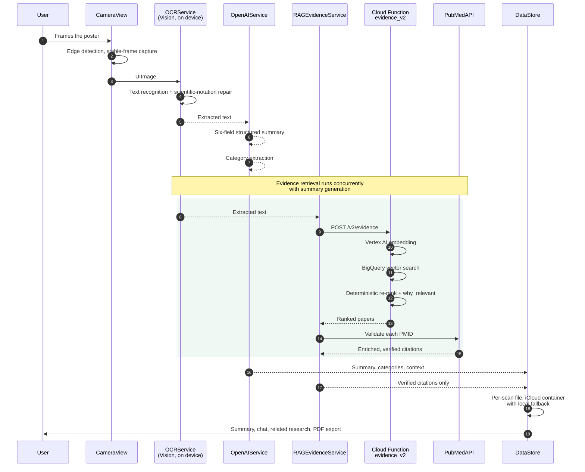

# PosterLens Architecture

PosterLens follows the MVVM (Model-View-ViewModel) architecture pattern to ensure separation of concerns and maintainable code.

## Components

### Models

- **PosterScan**: Core data model representing a scanned poster, including extracted text, summary, categories, and metadata
- **PosterCategory**: Research categorization model with color-coded tags
- **Citation**: Academic paper references with validation status
- **ResearchContext**: Author questions and future research directions
- **DataStore**: Persistence layer. Scans are stored as per-scan files in the user's iCloud
  container, with a local-only fallback and a migration path from the older single-file store
- **EvidenceResult**: Decodes the `evidence_v2` response — papers, similarity scores and
  `why_relevant` explanations
- **ChatMessage**: Represents individual messages in chat conversations
- **Conversation**: Contains collections of messages related to a specific poster

### Views

- **ContentView**: Main navigation container
- **CameraView**: Handles poster scanning with live preview and edge detection
- **SummaryView**: Displays extracted content and AI-generated insights
- **RelatedResearchView**: Shows discovered academic papers from PubMed
- **HistoryView**: Shows saved poster scans with category filtering
- **SimpleChatView**: Provides interactive chat interface for poster-specific questions
- **CategoryTagView**: Displays color-coded research category tags
- **CategoryDetailSheet**: Category organization and filtering

### Services

- **OCRService**: Handles text extraction from images using Apple Vision framework
- **OpenAIService**: Generates structured summaries and author questions via GPT-3.5-turbo
- **OpenAIChatService**: Powers interactive chat about poster content
- **PerplexityRelatedResearchService**: Discovers related papers using Perplexity Search API with domain filtering
- **CategoryExtractionService**: Automatic detection and tagging of research categories
- **PubMedAPI**: Validates and enriches citations with PubMed metadata
- **PDFExportService**: Generates paginated PDF documents from poster data
- **RAGEvidenceService**: Calls the `evidence_v2` Cloud Function for semantic retrieval over
  the PubMed corpus, gated behind `FeatureFlags.usePubMedRAG`
- **ImageOrientationFixer**: Normalises capture orientation before OCR

### Utilities

- **NetworkErrorHandler**: Centralized error handling with user-friendly messages
- **NetworkRequestHelper**: Automatic retry logic with exponential backoff
- **SafeJSONParser**: Crash-safe JSON parsing utilities
- **SecretManager**: Secure API key management from Secrets.plist
- **CitationEnhancer**: Improves citation formatting
- **HapticManager**: Provides tactile feedback throughout the app
- **DesignSystem**: Centralized styling and UI constants
- **Log**: Debug logging utilities

## App Workflow

1. User captures a poster image via CameraView
2. OCRService extracts text from the image using on-device Vision framework
3. OpenAIService generates a structured 4-point summary
4. CategoryExtractionService detects research categories
5. SummaryView displays the results with category tags
6. User can discover related research via PerplexityRelatedResearchService
7. PubMedAPI validates and enriches citations
8. User can interact via SimpleChatView powered by OpenAIChatService
9. User can save the scan, which is stored via DataStore
10. Scans can be exported as PDF using PDFExportService

## Data flow

Capture and OCR are on-device. Only extracted text is sent to any remote service — the
photograph never leaves the phone.

Two invariants hold throughout:

- **The image stays local.** OCR runs in the Vision framework on the device. Posters at
  embargoed sessions carry unpublished data; uploading photographs of them to a third-party
  API is not defensible, and the on-device path is faster in any case.
- **Citations come from retrieval, never generation.** Papers are retrieved by vector search
  and then validated against PubMed E-utilities. Anything that fails validation is dropped
  rather than displayed with a caveat.

### Retrieval paths

`FeatureFlags.usePubMedRAG` selects between two implementations that converge on the same
validation step:

| Flag | Path | Notes |
|---|---|---|
| `true` (default) | `RAGEvidenceService` → API Gateway → `evidence_v2` → Vertex AI + BigQuery | Semantic search over the project's own PubMed corpus, with deterministic re-ranking |
| `false` | `PerplexityRelatedResearchService` → Perplexity Search API | Legacy path, filtered to 14 trusted academic domains |

See [API_PIPELINE.md](API_PIPELINE.md) for detailed API documentation, and
[EXAMPLES.md](EXAMPLES.md) for the request and response shapes.

## State Management

- **@State**: For local view state
- **@EnvironmentObject**: For shared app-wide state
- **@ObservableObject**: For reactive data models

## Error Handling

All network operations use the centralized error handling system:
- Automatic retry with exponential backoff (3 attempts)
- User-friendly error messages via NetworkError
- Safe JSON parsing to prevent crashes
- Graceful degradation on API failures

See [ERROR_HANDLING_GUIDE.md](ERROR_HANDLING_GUIDE.md) for migration patterns.

## Backend

The RAG backend lives in [`functions/`](../functions/README.md): a Python Cloud Function
(`evidence_v2`) that embeds poster text with Vertex AI `text-embedding-004`, runs vector
search against a PubMed corpus in BigQuery, and applies a small deterministic re-ranking
layer for recency, keyword overlap and specificity. Corpus ingestion is in
[`functions/ingestion/`](../functions/ingestion/README.md) and is incremental, deduplicating
on PMID.

## Where this is going

See [ROADMAP.md](../ROADMAP.md). The near-term architectural work is moving the model calls
behind the same authenticated gateway the Evidence API uses, which removes the client-side
API key entirely.