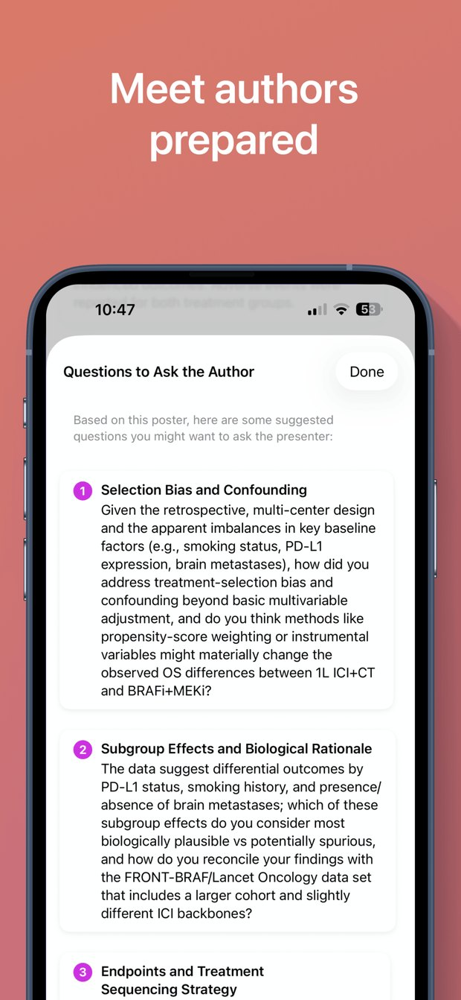
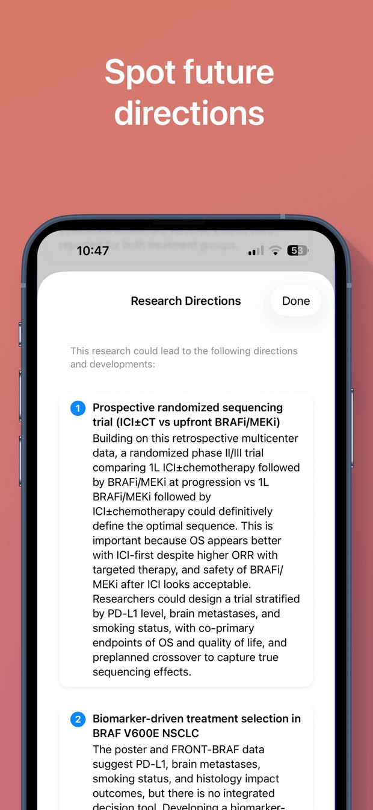

# Examples

A real poster, end to end, followed by the API shapes if you are wiring against the backend.

---

## One poster, start to finish

The poster below is a retrospective single-centre analysis in BRAF V600E mutant metastatic
non-small cell lung cancer, comparing first-line immune checkpoint inhibitors against
targeted BRAF/MEK inhibition. It is a good stress test: dense, statistics-heavy, and the
kind of poster where the interesting question is not in the conclusion.

### 1. Capture


Open the camera and frame the poster. Edge detection finds the boundary and captures when
the frame is stable — you do not need to hold a perfect rectangle.

Capture and text extraction both happen on the device. The photograph is stored locally and
is never uploaded. What travels onward is text.

Practical notes from real conference use:

- Stand back far enough to get the whole poster in frame. Section-by-section capture loses
  the relationships between panels, which is where most of the meaning lives.
- Glossy laminate plus overhead spotlights is the one condition that reliably defeats OCR.
  Shoot at a slight angle to move the reflection off the text.
- Portrait posters work better than landscape, simply because you can get closer.

<br clear="right">

### 2. Structured summary


Extracted text goes to the model, which returns six fields. From this poster:

> **Main research question/objective**
> Whether BRAF plus MEK inhibitors should be prioritized over immune checkpoint inhibitors
> as first-line therapy for patients with BRAF V600E mutant metastatic non-small cell lung
> cancer.

> **Patient population**
> 76 patients with metastatic NSCLC treated with first-line immune checkpoint inhibitors
> plus chemotherapy or BRAF/MEK inhibitors.

The remaining fields are primary endpoint, methodology, key results, and conclusions.

**Primary endpoint is the field to watch.** It is extracted verbatim, or left out. This
poster does not state one explicitly — a retrospective analysis often will not — so the app
does not invent one. That omission is itself information: it tells you the comparison you
are looking at was not pre-specified.

Categories are detected automatically and colour coded — here *Non-Small Cell Lung Cancer*,
*Treatment Prioritization*, *BRAF*. After four days of a congress they are the only reason
your history is navigable.

<br clear="right">

### 3. Questions worth asking



The generated questions are aimed at the weak points of the design rather than the content
of the poster. From this scan:

> **Selection bias and confounding**
> Given the retrospective, multi-center design and the apparent imbalances in key baseline
> factors (e.g., smoking status, PD-L1 expression, brain metastases), how did you address
> treatment-selection bias and confounding beyond basic multivariable adjustment, and do you
> think methods like propensity-score weighting or instrumental variables might materially
> change the observed OS differences between 1L ICI+CT and BRAFi+MEKi?

> **Subgroup effects and biological rationale**
> The data suggest differential outcomes by PD-L1 status, smoking history, and presence or
> absence of brain metastases; which of these subgroup effects do you consider most
> biologically plausible versus potentially spurious, and how do you reconcile your findings
> with the FRONT-BRAF/Lancet Oncology data set that includes a larger cohort and slightly
> different ICI backbones?

That is the difference the tool is trying to make: you arrive at the poster with a question
the presenter has to think about, rather than "could you walk me through it?".

<br clear="right">

### 4. Where the field is going



Research directions read the poster as a position in an ongoing argument and name the study
that would settle it:

> **Prospective randomized sequencing trial (ICI±CT vs upfront BRAFi/MEKi)**
> Building on this retrospective multicenter data, a randomized phase II/III trial comparing
> 1L ICI±chemotherapy followed by BRAFi/MEKi at progression vs 1L BRAFi/MEKi followed by
> ICI±chemotherapy could definitively define the optimal sequence. This is important because
> OS appears better with ICI-first despite higher ORR with targeted therapy, and safety of
> BRAFi/MEKi after ICI looks acceptable.

<br clear="right">

### 5. Ask it anything


Chat is grounded in the captured poster text, not in the model's general knowledge. Asking
*"What are the limitations of this research?"* on this scan returns retrospective design,
small sample size, imbalances in baseline factors, and the absence of a clearly defined
primary endpoint — each traceable to something the poster does or does not say.

Useful prompts in practice:

- *"What would change my mind about these results?"*
- *"Is the effect size clinically meaningful or just statistically significant?"*
- *"What is the comparator, and is it standard of care in the UK?"*
- *"Summarise this for someone who does not work in oncology."*

<br clear="right">

### 6. The papers behind it


Related Research retrieves genuine papers and validates each one against PubMed before it is
displayed. From this scan:

| Paper | Journal | Why it surfaced |
|---|---|---|
| Predictive and prognostic biomarkers with therapeutic targets in colorectal cancer: A 2021 update on current development, evidence, and recommendation | *J Oncol Pharm Pract* (2022) | Matches key terms from the poster: first-line, inhibitors, cancer |
| Early pembrolizumab clearance as prognostic biomarker for non-response in patients with advanced non-small cell lung cancer | *Int J Cancer* (2025) | Matches key terms from the poster: inhibitors, cancer, months |

Every entry carries a verified PubMed badge and a one-line explanation of why it was
retrieved. Citations that fail validation are dropped rather than shown — if a paper appears
in this list, the link resolves.

<br clear="right">

### 7. Take it with you

Export produces a paginated PDF containing the summary, categories, research directions and
related research, with your own notes attached. The raw OCR dump is deliberately excluded;
nobody has ever wanted to read it.

Scans sync through your own iCloud container, so the poster you scanned on Tuesday is on
your iPad on the train home.

---

## Working against the API

### Evidence endpoint

The RAG backend is a Cloud Function behind an API gateway. One endpoint, one job.

```http
POST /v2/evidence
Content-Type: application/json
x-api-key: <your key>
```

```json
{
  "text": "BRAF V600E mutant metastatic NSCLC. 76 patients treated with first-line immune checkpoint inhibitors plus chemotherapy or BRAF/MEK inhibitors. Overall survival, objective response rate..."
}
```

Response:

```json
{
  "status": "ok",
  "papers": [
    {
      "title": "Early pembrolizumab clearance as prognostic biomarker for non-response in patients with advanced non-small cell lung cancer",
      "abstract": "...",
      "pmid": "39812345",
      "score": 0.71,
      "why_relevant": "Matches key terms from the poster: inhibitors, cancer, months."
    }
  ],
  "metadata": {
    "version": "2.0.0",
    "timestamp": "2026-05-21T10:30:00Z",
    "text_length": 1234
  }
}
```

Errors keep the same envelope:

```json
{
  "status": "error",
  "error": {
    "code": "VALIDATION_ERROR",
    "message": "Description of what went wrong"
  }
}
```

`score` is the vector-similarity score after re-ranking. The re-ranker applies small additive
adjustments — recency, keyword overlap, a penalty for generic review language — deliberately
small enough that semantic similarity stays dominant. The constants are at the top of
[`functions/main.py`](../functions/main.py).

### Running it locally

```bash
cd functions
python -m venv venv && source venv/bin/activate
pip install -r requirements.txt
functions-framework --target=evidence_v2 --debug

curl -X POST http://localhost:8080/ \
  -H "Content-Type: application/json" \
  -d '{"text": "BRAF V600E mutant metastatic NSCLC, first-line therapy"}'
```

Point `Config.evidenceAPIURL` at `http://localhost:8080/` to run the app against it.

### Building your own corpus

```bash
cd functions/ingestion
python prepare_pubmed_subset.py --query "non-small cell lung cancer" --limit 500
python embed_and_load.py --input pubmed_subset.jsonl
```

Stage one queries PubMed E-utilities and writes JSONL. Stage two embeds each record with
Vertex AI `text-embedding-004` and loads it into BigQuery. Ingestion is incremental and
deduplicates on PMID, so re-running it to widen coverage is safe. See
[`functions/ingestion/README.md`](../functions/ingestion/README.md).

### Choosing the retrieval path

```swift
struct FeatureFlags {
    static let usePubMedRAG = true   // false → Perplexity Search API
}
```

Both paths converge on the same PubMed validation step before anything is displayed.

---

## Related reading

- [Architecture](ARCHITECTURE.md) — components and data flow
- [API pipeline](API_PIPELINE.md) — the four stages in full detail
- [API integration](API_INTEGRATION.md) — per-service contracts
- [Error handling](ERROR_HANDLING_GUIDE.md) — retry, backoff, degradation
